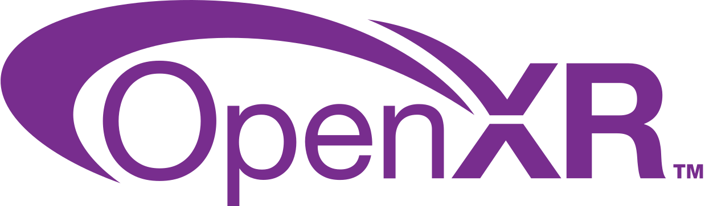

# Awesome OpenXR 

> A curated list of OpenXR links and resources.

[OpenXR](https://www.khronos.org/openxr/) is an open standard that provides native access to a range of virtual and augmented reality devices.

## Contents
- [Notable Apps](#notable-apps)
- [Development](#development)
  - [Engines](#engines)
  - [Runtimes](#runtimes)
- [Tutorials](#tutorials)
- [Communities](#communities)
- [Related Lists](#related-lists)

## Notable Apps
- [Microsoft Flight Simulator](https://www.flightsimulator.com/)
- [Minecraft in VR](https://www.minecraft.net/en-us/vr)

## Development

### Engines
- [Unreal](https://unity.com/) - One of the most used game engines, developed by Epic Games, and supporting OpenXR as of version 4.23.
  - [Official Documentation](https://docs.unrealengine.com/4.26/en-US/SharingAndReleasing/XRDevelopment/OpenXR/)

- [Unity](https://unity.com/) - A very popular game engine supporting OpenXR as of version 2020.2.0.
  - [Official Documentation](https://docs.unity3d.com/Packages/com.unity.xr.openxr@0.1/manual/index.html)

- [Godot](https://godotengine.org/) - A cross-platform, open-source engine with OpenXR support as of version 3.3.
  - [Official Documentation](https://github.com/GodotVR/godot_openxr/wiki)

### Runtimes

> [About OpenXR runtimes](https://monado.freedesktop.org/about-runtimes.html) - General background information about OpenXR runtimes.
- [Oculus OpenXR](https://developer.oculus.com/documentation/native/pc/dg-openxr/)
- [Varjo OpenXR](https://developer.varjo.com/docs/openxr/openxr) 
- [Monado](https://monado.freedesktop.org/)
- [SteamVR](https://store.steampowered.com/news/app/250820/view/2396425843528787269)

## Tutorials

- [Getting started with OpenXR](https://docs.microsoft.com/en-us/windows/mixed-reality/develop/native/openxr-getting-started#getting-started-with-openxr-for-windows-mixed-reality-headsets) - Microsoft guide to start developing using OpenXR for HoloLens 2 and Windows Mixed Reality headset.

- [Introduction to OpenXR](https://playdeck.net/blog/introduction-to-openxr) - Building a cross-platform Mixed Reality application from scratch, without game engines, and deploying it to Hololens 2.

## Communities

- [Khronos OpenXR Forum](https://community.khronos.org/c/openxr/) - Official OpenXR forum by the Khronos Group, the consortium developing OpenXR.
- [KhronosDevs Slack](https://khr.io/slack) - Official Khronos Developer Slack, containing an OpenXR channel.
- [r/OpenXR](https://www.reddit.com/r/OpenXR/) - Main subreddit for OpenXR.
- [Monado Discord](https://discord.gg/8RkJgRJ) - Official Discord server for Monado, the first OpenXR runtime for GNU/Linux.

## Related Lists
*  [awesome](https://github.com/sindresorhus/awesome) - Curated list of awesome lists.
*  [awesome-webxr](https://github.com/msub2/awesome-webxr) - Curated list of WebXR links and resources.
*  [awesome-opengl](https://github.com/eug/awesome-opengl) - Curated list of awesome OpenGL libraries, debuggers and resources.
*  [awesome-vulkan](https://github.com/vinjn/awesome-vulkan) - Curated list of awesome Vulkan libraries, debuggers and resources.

